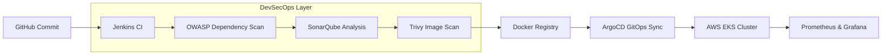

# End-to-End GitOps Deployment: Student Management System (MERN) 🚀

This project demonstrates a professional-grade, enterprise-ready CI/CD ecosystem. It implements a full **DevSecOps** pipeline that automates the journey from a developer's commit to a production-ready deployment on **AWS EKS** using a **GitOps** philosophy.

## 🏗️ System Architecture

The project follows a three-tier MERN stack architecture (MongoDB, Express, React, Node) deployed on a managed Kubernetes cluster.

### 🔄 The Deployment Workflow

---

## 🧰 DevOps Toolchain & Justification

| Tool | Role | Why this tool? |
| :--- | :--- | :--- |
| **Jenkins** | CI Orchestrator | For complex, customizable pipeline logic and extensive plugin support. |
| **SonarQube** | Static Analysis | To ensure code quality and maintainability before images are built. |
| **OWASP DC** | Software Composition Analysis | To identify and mitigate vulnerabilities in open-source dependencies. |
| **Trivy** | Container Security | To ensure the final Docker image is free of OS-level vulnerabilities. |
| **ArgoCD** | GitOps CD | To ensure the cluster state always matches the Git repository (Single Source of Truth). |
| **AWS EKS** | Orchestration | To provide a scalable, managed Kubernetes environment for the MERN app. |
| **Prometheus/Grafana** | Observability | To monitor pod health and cluster performance in real-time. |

---

## 🚀 Key Implementation Highlights

### 1. DevSecOps Integration
Instead of simple builds, this pipeline implements a **"Security Gate"** strategy. The build fails immediately if:
- SonarQube Quality Gate is not met.
- High-severity vulnerabilities are found by OWASP or Trivy.

### 2. GitOps Workflow with ArgoCD
By decoupling CI (Jenkins) from CD (ArgoCD), the project achieves:
- **Faster Recovery**: One-click rollback to previous versions via Git.
- **Configuration Drift Detection**: ArgoCD automatically detects and corrects manual changes in the cluster.

### 3. Scalable Monitoring
Deployed a full monitoring stack using **Helm**, allowing for granular visibility into the Kubernetes node and pod metrics.

---

## 🛠️ Setup & Installation Guide

### 📦 Prerequisites
- AWS Account (Region: `us-west-1`)
- EC2 Instance (t2.large) for Jenkins Master
- IAM User with Administrator access

### 🚀 Deployment Steps
1. **Infrastructure Setup**:
   - Provision EKS Cluster using `eksctl`.
   - Setup Jenkins Master and Worker nodes via SSH.
2. **Tooling Installation**:
   - Install Docker, Trivy, and SonarQube.
   - Configure ArgoCD via Kubernetes manifests.
3. **Pipeline Configuration**:
   - Install Jenkins plugins: `OWASP`, `SonarQube Scanner`, `Docker Pipeline`.
   - Configure Webhooks for GitHub $\rightarrow$ Jenkins and SonarQube $\rightarrow$ Jenkins.
4. **Application Deployment**:
   - Connect the GitHub repo to ArgoCD.
   - Define the destination EKS cluster and sync the manifests.

---

## 📊 Results & Monitoring
The system provides real-time visibility into the deployment health.
- **Prometheus** handles the metric scraping.
- **Grafana** visualizes the pod distribution and resource utilization.

---

## 🧠 Challenges & Lessons Learned
- **Credential Management**: Solved Docker socket permission issues by configuring the Jenkins worker user correctly.
- **State Synchronization**: Learned the importance of `auto-create namespace` in ArgoCD to streamline the first-time deployment of new environments.
